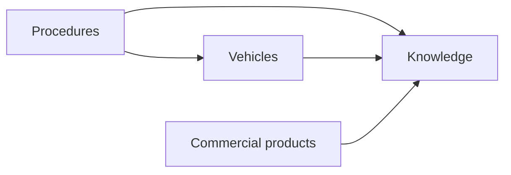

# Arquitectura

La estructura interna y la navegación pública persiguen objetivos distintos:

- La **estructura interna** evita duplicidades y mantiene relaciones claras.
- La **navegación pública** prioriza la forma en que las personas buscan soluciones.

## Navegación pública

1. **Procedimientos**
2. **Vehículos**
3. **Knowledge**
4. **Acerca del proyecto**

## Estructura lógica

```text
docs/
├── procedures/
├── vehicles/
├── knowledge/
│   ├── concepts/
│   ├── chemicals/
│   ├── lubricants/
│   ├── materials/
│   ├── components/
│   ├── assembly/
│   ├── commercial-products/
│   └── references/
├── about/
└── templates/
```

## Responsabilidad de cada sección

### Procedures

Contiene instrucciones orientadas a una tarea. Debe ofrecer un resumen operativo, requisitos, advertencias, pasos, comprobaciones y enlaces a conocimiento relacionado.

### Vehicles

Contiene información específica de grupos, plataformas y modelos: variantes, códigos, referencias, pares, compatibilidades y particularidades.

La convención de carpetas de modelo es descriptiva:

```text
vehicles/VAG/Seat-Leon_1M/
vehicles/VAG/VW-Golf_IV/
vehicles/PSA/Peugeot-307_T5/
```

El conocimiento compartido entre varios modelos se almacena en `shared/` dentro del grupo correspondiente.

### Knowledge

Contiene conocimiento independiente de un modelo concreto:

- **Concepts:** pH, vacío, presión, par, fricción, corrosión o viscosidad.
- **Chemicals:** familias químicas de limpieza y protección.
- **Lubricants:** grasas, aceites, pastas y lubricantes en aerosol.
- **Materials:** metales, plásticos, elastómeros y recubrimientos.
- **Components:** componentes mecánicos y su funcionamiento general.
- **Assembly:** fijadores, retenedores, selladores y productos de montaje.
- **Commercial products:** fichas de productos concretos vinculadas a una familia técnica.
- **References:** leyendas, matrices, normas y referencias auxiliares.

## Dirección de las dependencias



`Knowledge` no debe depender de un vehículo ni de un procedimiento concreto.

## Evitar duplicación

Un procedimiento puede resumir por qué utiliza un producto, pero la explicación completa permanece en su ficha técnica. Una página de vehículo documenta únicamente la variante o aplicación específica de ese modelo.
