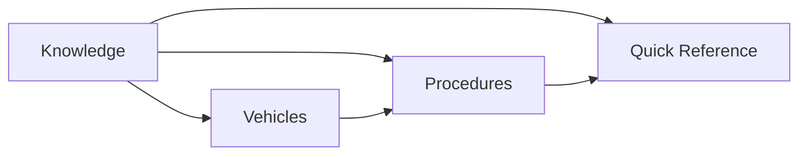
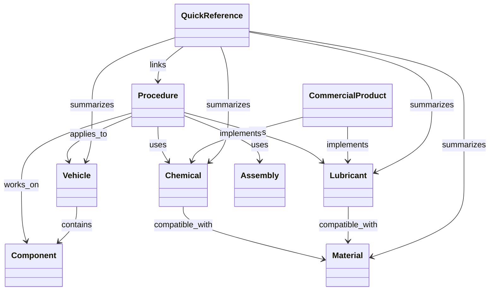

# Modelo de datos

Garage Handbook usa Markdown como formato de lectura y front matter YAML como capa de datos estructurados.

## Entidades principales

| Entidad | Propósito | Ejemplo |
|---|---|---|
| `concept` | Fundamento transversal | pH, vacío, par |
| `chemical` | Familia química o función de limpieza | APC, limpiafrenos |
| `lubricant` | Lubricación o protección frente a desgaste | grasa de silicona |
| `material` | Sustrato o material técnico | EPDM, aluminio |
| `component` | Componente automotriz general | pinza, servofreno |
| `assembly` | Producto de unión, sellado o montaje | fijador anaeróbico |
| `commercial-product` | Producto concreto del mercado | Koch Chemie Green Star |
| `vehicle` | Modelo, plataforma o variante | Seat León 1M ASV |
| `procedure` | Trabajo paso a paso | cambio de discos y pastillas |
| `quick-reference` | Vista rápida derivada de otras entidades | matriz de pulverizadores IK |

## Capas de consumo



- **Knowledge** conserva la explicación técnica y actúa como fuente de verdad.
- **Procedures** explica cómo ejecutar un trabajo.
- **Vehicles** añade aplicabilidad y particularidades concretas.
- **Quick Reference** resume datos para una consulta inmediata.

## Relaciones



## Contextos de uso

`detailing` y `workshop` son contextos, no ramas independientes de conocimiento. Una misma familia química puede aparecer en ambos contextos sin duplicar su ficha.

```yaml
contexts:
  - detailing
  - workshop
```

## Identificadores

Los identificadores estables podrán incorporarse cuando exista suficiente contenido para justificar un catálogo central. Hasta entonces, la ruta y el tipo de entidad son suficientes.

No se asignarán IDs secuenciales prematuramente, para evitar mantener un registro artificial sin una funcionalidad que lo consuma.

## Compatibilidad

Los valores recomendados son:

- `compatible`
- `conditional`
- `incompatible`
- `unknown`
- `not-applicable`

Una compatibilidad debe poder acompañarse de condiciones como concentración, dilución, temperatura, tiempo de contacto o necesidad de prueba previa.

## Contrato de metadatos

El contrato común y los campos específicos de cada entidad se definen en [Esquema de metadatos](metadata-schema.md).

## Evolución futura

El front matter podrá utilizarse para generar matrices, índices y filtros automáticos. Las claves nuevas deben añadirse cuando exista una funcionalidad real que las consuma, evitando modelar datos especulativos.
